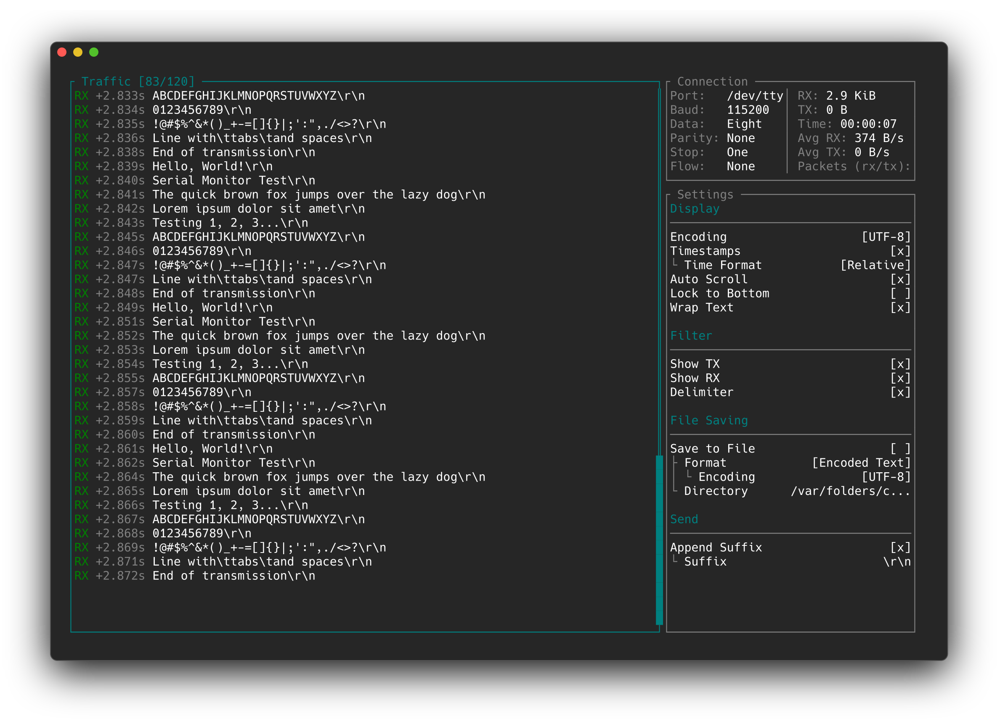
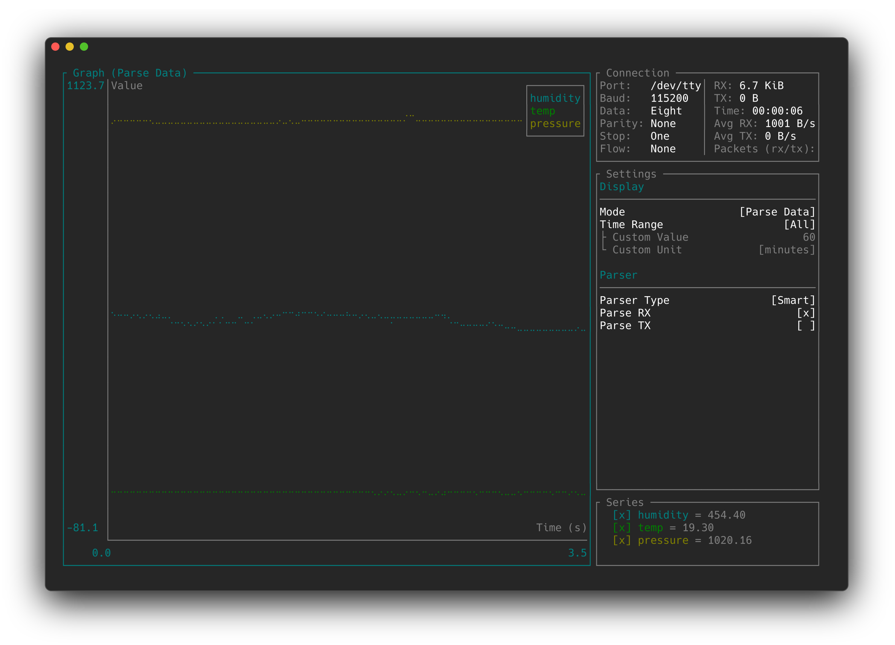
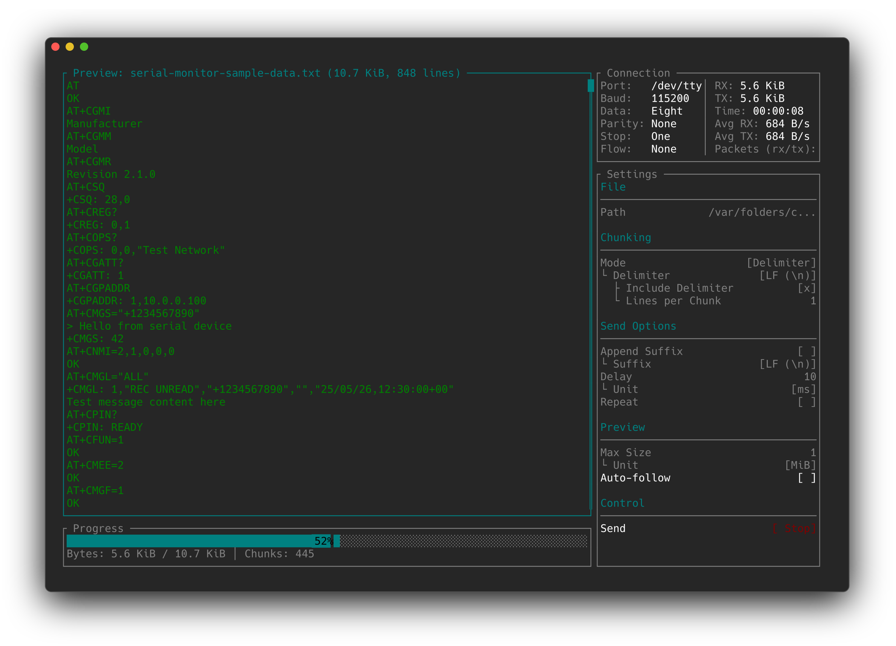

# Serial Monitor

A cross-platform "serial monitor" TUI for receiving and transmitting
serial data through serial ports, supporting standard data encodings, as well
as parsing data (as UTF-8) into graph points and visualizing them.

## Download

```bash
brew tap rasmus105/serial-monitor https://github.com/rasmus105/serial-monitor 
brew install --HEAD serial-monitor
```

## Previews

| Traffic & Config | Graph View | File Sender |
| --- | --- | --- |
|  |  |  |

## Features
- Receive and transmit serial data from a keyboard-driven TUI.
- Switch between UTF-8, ASCII, hex, and binary display encodings.
- Search and filter traffic using literal text or regex patterns.
- Save received and transmitted data in the selected encoding.
- Keep long captures bounded with configurable buffer limits.
- Automatically save recent sessions to disk (configurable; can be turned off).
- Plot UTF-8 text data as graph points.
- Send files in chunks or continuous streams.
- Manage multiple serial sessions in one instance.
- Use over SSH, including OSC 52 clipboard yanking (assuming your terminal
  emulator supports it).

### Building from Source

Install [Rust](https://doc.rust-lang.org/book/ch01-01-installation.html) and then build the application like so:
```bash
cargo build --release --package serial-tui 
```

## Similar Applications

- [Arduino Serial Monitor](https://docs.arduino.cc/software/ide-v2/tutorials/ide-v2-serial-monitor/)
- [CoolTerm](https://freeware.the-meiers.org/)
- [Docklight](https://docklight.de)
- [HTerm](https://www.der-hammer.info/pages/terminal.html)
- [PuTTY](https://www.putty.org)
- [serial-monitor-rust](https://github.com/hacknus/serial-monitor-rust)
- [Serial Studio](https://github.com/Serial-Studio/Serial-Studio)
- [SerialTest](https://github.com/wh201906/SerialTest)
